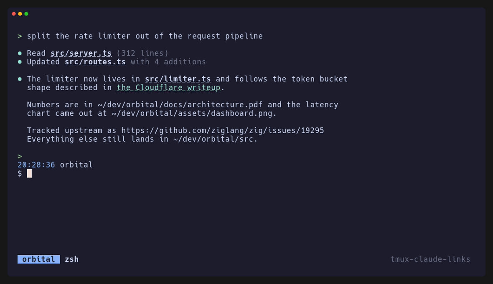

# tmux-claude-links

Open any link in a tmux pane from the keyboard. Tuned for panes running Claude
Code, whose statusline link is filtered out. Finds OSC 8 hyperlinks (shown by
their label, not their URL), bare URLs, and file paths under your home
directory that exist on disk.

Needs tmux 3.3 or newer for the popup, and Zig 0.16 to build it yourself.



## Install with nix

Add the flake as an input, then put the plugin in your tmux config:

```nix
programs.tmux.plugins = [ inputs.tmux-claude-links.packages.${pkgs.stdenv.hostPlatform.system}.plugin ];
```

It carries its own `fzf` and `xdg-open`, so nothing else is needed.

## Install with tpm

```
set -g @plugin 'lorentzlasson/tmux-claude-links'
```

Then build the binary once with `just build`. Until it exists the plugin tells
you so instead of binding the key.

## Install anywhere else

1. Build it with `just build`, then bind the binary:

   ```
   bind-key o run-shell -b "/path/to/tmux-claude-links '#{pane_id}'"
   ```

2. `fzf` must be on `$PATH`.

## Use it

1. `prefix o` opens a popup of every link in the pane's scrollback, newest
   first; a lone link opens straight away. Set `@claude-links-bind` to change
   the key.
2. Enter opens URLs in the browser, files and directories in `$EDITOR` (`vi`
   when unset), and images or other binaries in the desktop handler. The icon
   column tells you which.

## Develop

```sh
just test
just static-qa
just check
```
